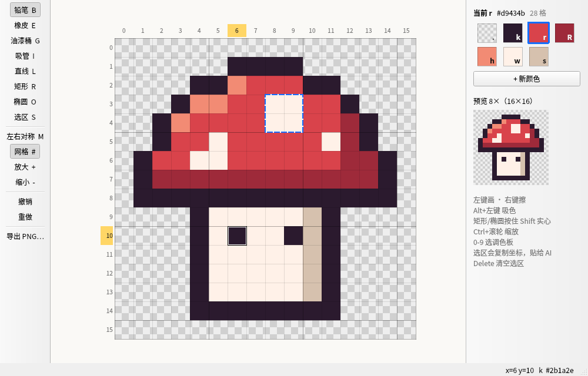

# pixel4ai — 给 AI 用的像素网格画板

画布被分成 W×H 个格子，**每格只能是一种颜色**。AI（Claude Code）用 `pxl` 命令画，你用编辑器看着渲染效果直接改，两边改的是同一个文件。

| 组成 | 给谁用 | 做什么 |
| --- | --- | --- |
| `pxl` 命令行 | AI（通过 Skill 调用），也可以自己用 | 画点、线、矩形、椭圆，油漆桶，贴子网格，镜像……每次修改都回显带坐标尺的视图，方便核对 |
| `pxl-edit` 编辑器 | 人 | 看着实际颜色点格子修改；AI 改了文件会自动刷新 |
| `skills/pixel-art` | AI | 工作流程、命令写法、像素画规则 |
| `refs/dither` | AI | 像素抖动参考库，AI 用 `pxl ref` 按需查询 |


工作原理和设计取舍见 [DESIGN.md](DESIGN.md)，待办事项见 [TODO.md](TODO.md)。

## 目录

- [安装](#安装)（新用户按 1–7 步做）
  - [1. 环境要求](#1-环境要求)
  - [2. 下载代码](#2-下载代码)
  - [3. 安装 PyQt6](#3-安装-pyqt6)
  - [4. 运行安装脚本](#4-运行安装脚本)
  - [5. 设置 PATH](#5-设置-path)
  - [6. 验证安装](#6-验证安装)
  - [7. 在 Claude Code 里使用](#7-在-claude-code-里使用)
- [更新](#更新) · [卸载](#卸载) · [常见问题](#常见问题)
- [快速上手](#快速上手) · [编辑器](#编辑器) · [文件格式](#文件格式-pxl) · [命令](#命令) · [项目结构](#项目结构) · [自测](#自测)

---

## 安装

支持的系统：**Linux**（在 Debian 13 上实测）；**macOS** 理论上可用，但没有实测；**Windows** 请在 WSL2 里按 Linux 的步骤安装。

安装脚本只创建 3 个软链接，不复制文件、不需要 sudo、不修改你的 shell 配置。

### 1. 环境要求

| 需要 | 做什么用 | 检查命令 | 没有的话 |
| --- | --- | --- | --- |
| **Python 3.10 或更高** | 所有功能 | `python3 --version` | Debian/Ubuntu：`sudo apt install python3`；macOS：`brew install python` |
| **Git** | 下载和更新代码 | `git --version` | Debian/Ubuntu：`sudo apt install git`；macOS：`xcode-select --install` |
| PyQt6 | 只有编辑器需要 | 见第 3 步 | 不装也能用命令行和 AI |
| Claude Code | 让 AI 画图 | `claude --version` | 只想自己用命令行和编辑器的话可以不装 |

每条检查命令能输出版本号，就说明装好了。命令行本身不依赖任何第三方 Python 库。

### 2. 下载代码

```bash
git clone https://github.com/7SeaJim/pixel4ai.git
cd pixel4ai
```

用 SSH 的话：`git clone git@github.com:7SeaJim/pixel4ai.git`。

- 项目放在哪个目录都可以，下文把这个文件夹称为「项目目录」。
- 安装用的是软链接，**装好之后不要删除项目目录**。如果要换位置，移动后在新位置重新运行一次 `./install.sh`，它会自动修复链接。
- 没有 Git 也可以在 GitHub 页面点 Code → Download ZIP 下载解压；这种情况下第 4 步请用 `bash install.sh` 运行。

### 3. 安装 PyQt6

**只有编辑器需要**，不用编辑器可以跳过这一步，以后再装。

| 系统 | 命令 |
| --- | --- |
| Debian 12+ / Ubuntu 22.04+ | `sudo apt install python3-pyqt6` |
| Fedora | `sudo dnf install python3-pyqt6` |
| Arch | `sudo pacman -S python-pyqt6` |
| macOS（Homebrew） | `brew install pyqt` |
| 其他 | `python3 -m pip install --user PyQt6` |

检查是否装好：

```bash
python3 -c "import PyQt6.QtWidgets; print('PyQt6 OK')"
```

如果 pip 报 `externally-managed-environment`，说明系统不允许用 pip 往全局装包，请改用上表里的系统包管理器命令。

### 4. 运行安装脚本

在项目目录里执行：

```bash
./install.sh
```

正常的输出如下（路径以你自己的为准）：

```
pixel4ai 项目目录：/home/you/pixel4ai
  已创建  /home/you/.local/bin/pxl -> /home/you/pixel4ai/bin/pxl
  已创建  /home/you/.local/bin/pxl-edit -> /home/you/pixel4ai/bin/pxl-edit
  已创建  /home/you/.claude/skills/pixel-art -> /home/you/pixel4ai/skills/pixel-art

自检
  ✓ /home/you/.local/bin 在 PATH 里：终端里可以直接输入 pxl、pxl-edit
  ✓ 命令行可以运行（AI 通过 /home/you/.claude/skills/pixel-art/scripts/pxl 调用，不依赖 PATH）
  ✓ 抖动参考库完整
  ✓ PyQt6 已安装，编辑器可用
  ✓ 找到 Claude Code

安装完成。
  · 终端：新开一个终端，输入 pxl --help
  · Claude Code：必须新开会话（已经打开的会话看不到新装的 Skill），输入 /skills 应能看到 pixel-art
```

自检行开头的符号：

| 符号 | 含义 |
| --- | --- |
| `✓` | 正常 |
| `!` | 需要注意，但不影响使用（最常见的是 PATH，见第 5 步） |
| `-` | 可选组件没装（PyQt6、Claude Code），不需要可以忽略 |
| `✗` | 必须处理，按那一行的提示做，然后重新运行 `./install.sh` |

脚本创建的 3 个软链接：

| 链接 | 作用 |
| --- | --- |
| `~/.local/bin/pxl` → `bin/pxl` | 终端里直接输入 `pxl` |
| `~/.local/bin/pxl-edit` → `bin/pxl-edit` | 终端里直接输入 `pxl-edit` |
| `~/.claude/skills/pixel-art` → `skills/pixel-art` | 让 Claude Code 发现这个 Skill |

脚本可以重复运行：已经装好的会跳过，失效的链接会修复，被别的文件占用的位置不会覆盖。想装到别的位置，可以设置环境变量，例如 `XDG_BIN_HOME=~/bin ./install.sh`；Claude Code 的配置目录则用 `CLAUDE_CONFIG_DIR` 指定。

### 5. 设置 PATH

**只有自检里出现 `! …/.local/bin 不在 PATH 里` 时才需要做。** 安装脚本会直接给出适合你当前 shell 的命令，照着执行即可。常见的几种如下：

| 你的 shell（`echo $SHELL` 查看） | 执行一次 |
| --- | --- |
| bash（Linux） | `echo 'export PATH="$HOME/.local/bin:$PATH"' >> ~/.bashrc` |
| bash（macOS） | `echo 'export PATH="$HOME/.local/bin:$PATH"' >> ~/.bash_profile` |
| zsh（macOS 默认） | `echo 'export PATH="$HOME/.local/bin:$PATH"' >> ~/.zshrc` |
| fish | `fish_add_path ~/.local/bin` |

执行后**关闭并重新打开终端**，再检查：

```bash
command -v pxl        # 应输出 /home/you/.local/bin/pxl 这样的路径
```

不设置 PATH 也能用，只是每次要输入完整路径 `~/.local/bin/pxl`。AI 调用不依赖 PATH，不受影响。

### 6. 验证安装

新开一个终端，逐条执行：

```bash
pxl --help | head -2
cd /tmp
pxl hello.pxl new 8 4 -q
pxl hello.pxl rect 1 1 6 2 k --fill -q
pxl hello.pxl export ascii
```

最后一条命令应该输出：

```
........
.kkkkkk.
.kkkkkk.
........
```

再检查另外两部分：

```bash
pxl ref dither --check     # 应输出：✓ refs/dither 没有问题（1 个条目）
pxl-edit /tmp/hello.pxl    # 装了 PyQt6 的话，会弹出编辑器窗口
```

### 7. 在 Claude Code 里使用

1. **新开一个 Claude Code 会话。** 已经打开的会话看不到新装的 Skill。后台任务也可能用的是安装之前就预先启动的进程，一样看不到。
2. 输入 `/skills`，列表里应该有 `pixel-art`。
3. 直接告诉它要画什么，例如：
   > 用 pixel-art 画一个 32×32 的像素风宝箱，保存到 ~/pixel/chest.pxl 并导出 PNG
4. 用 `pxl-edit ~/pixel/chest.pxl` 打开手动修改。改完告诉 AI「我改了，继续」，它会先读最新的文件再动手。

**不需要告诉 AI 项目装在哪。** Skill 里的命令写成 `${CLAUDE_SKILL_DIR}/scripts/pxl`，Claude Code 加载 Skill 时会把变量换成 Skill 的实际目录，入口脚本再顺着软链接找到项目。

---

## 更新

```bash
cd 项目目录
git pull
```

- 软链接直接指向项目目录，拉取后立即生效，一般不用重新安装。
- `skills/pixel-art/SKILL.md` 有变化时，需要新开 Claude Code 会话才能用上新版。
- 如果 `install.sh` 本身有更新，再运行一次 `./install.sh` 也是安全的。

## 卸载

```bash
cd 项目目录
./install.sh --uninstall
```

这只会删除那 3 个指向本项目的软链接，不会动项目文件。之后可以直接删除项目目录。第 5 步加进 shell 配置里的 PATH 那一行，可以保留，也可以手动删除。

## 常见问题

| 现象 | 原因 | 解决 |
| --- | --- | --- |
| `./install.sh: Permission denied` | 用 ZIP 下载时丢失了可执行权限 | 改用 `bash install.sh` |
| `请用 bash 运行` | 用了 `sh install.sh` | 改用 `bash install.sh` |
| `✗ 找不到 python3`，或 `版本是 3.x，需要 3.10 或更高` | Python 没装或版本太旧 | 见第 1 步 |
| `pxl: command not found` | `~/.local/bin` 不在 PATH 里，或者设置后没有重开终端 | 见第 5 步；也可以暂时用完整路径 `~/.local/bin/pxl` |
| `✗ 跳过 … 已被占用` | 那个位置已经有同名文件（比如装过别的 `pxl`） | 确认不需要后删除它，再运行 `./install.sh`；或者用 `XDG_BIN_HOME=其他目录 ./install.sh` 装到别处 |
| `编辑器需要 PyQt6` | 没装 PyQt6 | 见第 3 步 |
| pip 报 `externally-managed-environment` | 系统不允许 pip 装到全局（Debian 12+、Homebrew 的 Python 等） | 改用系统包管理器安装，见第 3 步 |
| 编辑器报 `Could not load the Qt platform plugin "xcb"` | 用 pip 装的 PyQt6 缺少系统图形库 | Debian/Ubuntu：`sudo apt install libxcb-cursor0` |
| Claude Code 里 `/skills` 看不到 `pixel-art` | 会话是在安装之前启动的 | 新开会话；还是没有的话，用 `ls -l ~/.claude/skills/` 确认链接存在，再重新运行 `./install.sh` |
| AI 没有用 Skill，而是自己写脚本画图 | 同上；或者提问里没有提到像素画 | 新开会话，并在提问里写上「用 pixel-art」 |
| 报 `找不到 pixel4ai 项目` | Skill 目录是复制过去的而不是软链接，或者项目被删除 / 移动了 | 在项目目录运行 `./install.sh`；如果一定要复制安装，设置环境变量 `PIXEL4AI_HOME=项目目录` |
| 项目换了位置后命令失效 | 软链接还指向旧位置 | 在新位置运行 `./install.sh`，会显示「已修复」 |
| Windows 上无法运行 | 安装脚本需要 bash 和软链接 | 使用 WSL2，在 WSL 里按上面的步骤安装 |

---

## 快速上手

```bash
pxl slime.pxl new 16 16 --palette pico8     # 新建 16×16 画布，使用 PICO-8 调色板
pxl slime.pxl ellipse 2 5 13 14 g --fill    # 画一个实心椭圆
pxl slime.pxl edit                          # 打开编辑器，边看边改
pxl slime.pxl export png --scale 16         # 导出 slime.png，每格 16px
pxl slime.pxl export ansi                   # 在终端里直接看彩色效果
```

也可以直接跟 Claude 说「用 pixel-art 画一个 16×16 的史莱姆」，然后打开编辑器手动修；修完告诉它「我改了，继续」。

上面的蘑菇 `examples/mushroom.pxl` 就是按 Skill 流程画的样例。

## 编辑器



启动方式任选一种：
- `pxl-edit [画.pxl]`：不给文件时弹窗选择打开或新建
- `pxl 画.pxl edit` 或 `pxl edit 画.pxl`：文件不存在时会弹窗新建
- `python3 src/pixel4ai/editor.py [画.pxl]`：不安装也能直接运行

窗口里也能随时 Ctrl+N 新建、Ctrl+O 打开。

| 操作 | 效果 |
| --- | --- |
| 左键 / 拖动 | 用当前工具和颜色画 |
| 右键 / 拖动 | 擦成透明 |
| Alt + 左键 | 吸色 |
| B E G I L R O S | 铅笔 / 橡皮 / 油漆桶 / 吸管 / 直线 / 矩形 / 椭圆 / 选区 |
| 矩形、椭圆按住 Shift | 实心 |
| M | 左右对称绘制 |
| 选区 | 坐标 `(x0,y0)-(x1,y1)` 复制到剪贴板，贴给 AI 就能说「改这块」；Delete 清空 |
| 0-9 | 选调色板第 N 个颜色（0 是透明） |
| 双击色块 / 右键色块 | 改颜色 / 删除颜色 |
| Ctrl+滚轮、+ -、Ctrl+0 | 缩放、适应窗口 |
| Ctrl+Z、Ctrl+Shift+Z | 撤销、重做（和命令行共用同一个撤销栈） |

每一笔松开鼠标就保存。保存时先读磁盘上的最新内容再叠加这一笔，所以 AI 刚做的改动不会被覆盖。

## 文件格式 `.pxl`

纯 JSON，每行一个字符串、上下对齐，文件本身就能当 ASCII 画看，也方便 git diff：

```json
{
  "version": 1,
  "size": [6, 3],
  "palette": {
    ".": null,
    "k": "#111111",
    "r": "#d9434b"
  },
  "rows": [
    ".kkkk.",
    "krrrrk",
    ".kkkk."
  ]
}
```

- `.` 是透明，固定在调色板里。调色板字符可以是单个字母、数字或 `#@%&*+=~^$:;<>|/!`。
- 坐标 `(x, y)` 从 0 开始，原点在左上角，区域两端都包含。
- 画布宽高 1..1024。超过 64 行或列时，`view` 和修改后的回显自动变成缩略视图（`--region` 看逐格细节）；编辑器只绘制可见区域，坐标尺吸附在视野边上。
- 撤销历史存在旁边的隐藏目录 `.文件名.pxl.history/`，每步一个压缩快照，最多 50 步。

## 命令

`pxl --help` 看完整列表，常用命令和批量脚本 `apply` 的写法见 [skills/pixel-art/SKILL.md](skills/pixel-art/SKILL.md)。

批量脚本是原子操作：任意一行出错，整个文件保持不变，并告诉你是第几行、为什么错。

查参考库（不需要画布文件）：

```bash
pxl ref                           # 有哪些参考库
pxl ref dither                    # 抖动：按场景选择 + 规则 + 反例
pxl ref dither reference-strip    # 单个条目：做法、禁忌、预览图路径（--full 看全部）
pxl ref dither --find 光晕        # 按关键词找条目和场景
pxl ref dither --check            # 校验 catalog.json 和它引用的文件
```

参考库的内容在 [refs/dither/](refs/dither/README.md)。

## 项目结构

```
pixel4ai/
├── install.sh           安装 / 卸载 / 自检
├── bin/
│   ├── pxl              命令行入口
│   └── pxl-edit         编辑器入口
├── src/pixel4ai/
│   ├── core.py          画布数据模型、绘图操作、撤销历史
│   ├── render.py        坐标尺视图、PNG / ASCII / ANSI 导出
│   ├── cli.py           pxl 命令解析、批量脚本
│   ├── refs.py          pxl ref 参考库查询
│   └── editor.py        PyQt6 编辑器
├── skills/pixel-art/    给 AI 的 Skill（SKILL.md + 入口脚本）
├── refs/dither/         像素抖动参考库：效果图 + 描述
├── examples/            样例 .pxl 和导出的 PNG
├── docs/                README 用的截图
└── tests/               自测
```

## 自测

```bash
QT_QPA_PLATFORM=offscreen python3 -m unittest discover -s tests
```

没有装 PyQt6 时，编辑器相关的测试会自动跳过。

覆盖：文档校验、各种绘图操作的形状、越界和调色板报错、撤销重做、PNG 解码、批量脚本的原子性、命令行里的 `#` 字符、大画布、参考库查询、Skill 入口在不带 PATH 时的调用。编辑器部分会离屏模拟鼠标操作，确认外部修改后自动刷新、自己的一笔不会覆盖外部改动、撤销正常。
